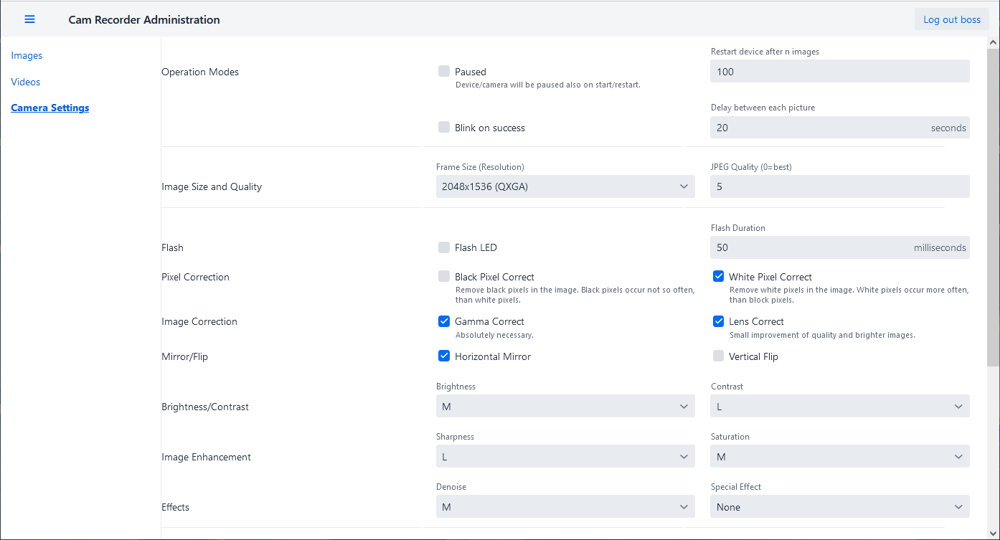
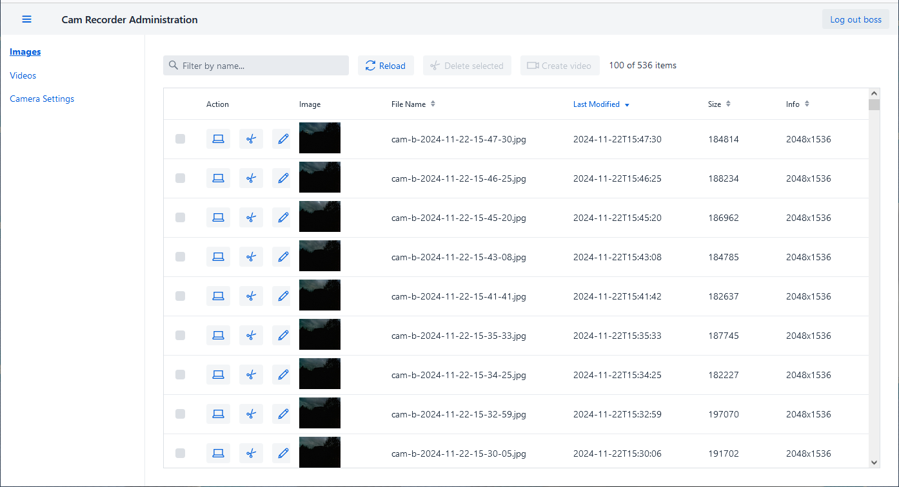
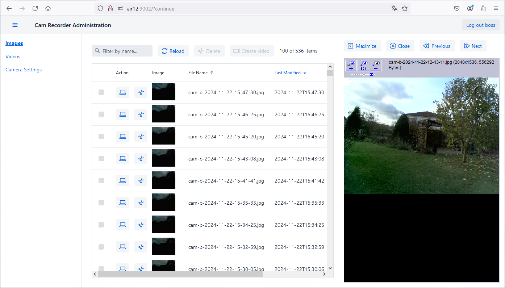
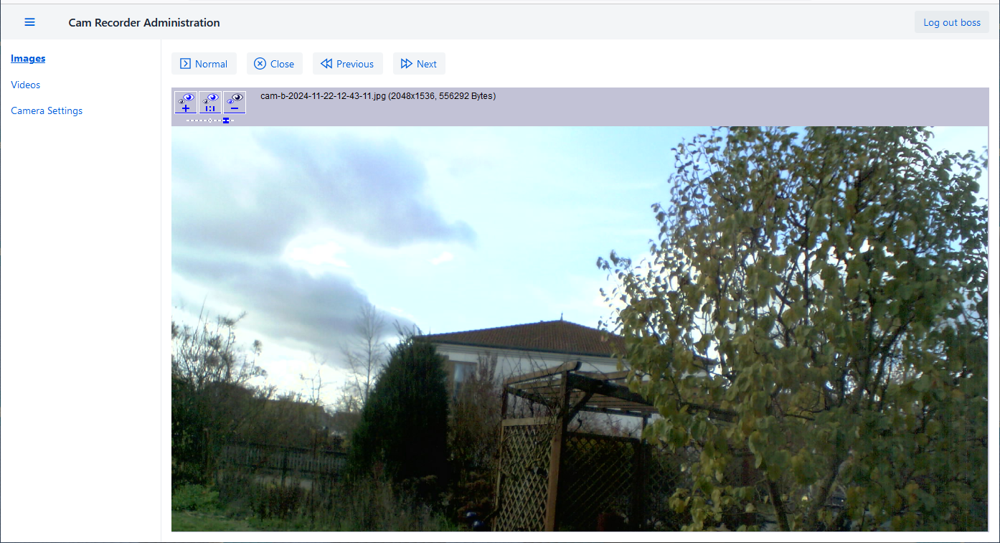

# Client and Server for recording ESP32 camera images

- [client](client/README.md)
- [server](server/README.md)
- [server-ui](server-ui/README.md)

## UI

Form for Camera Settings

List of captures images

List of created timelapse videos

Captures image list with image display side-by-side

Full view of a captured image

