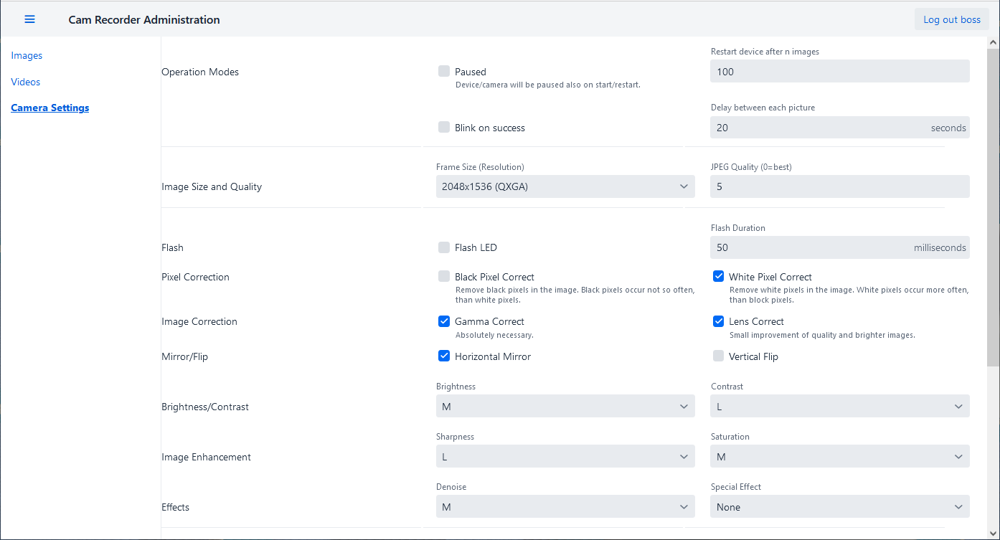
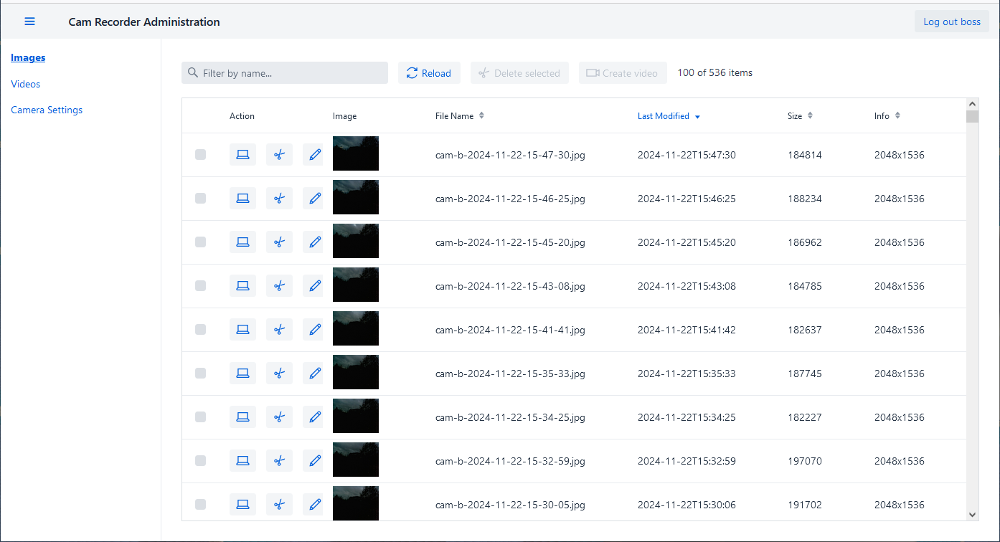
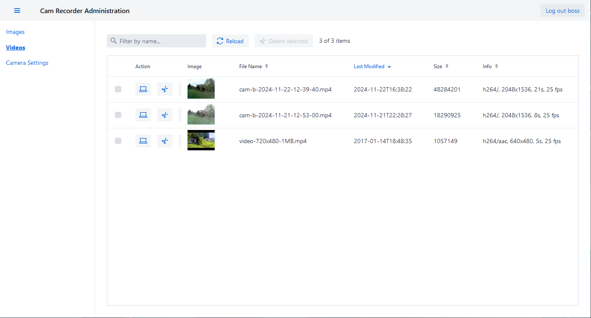
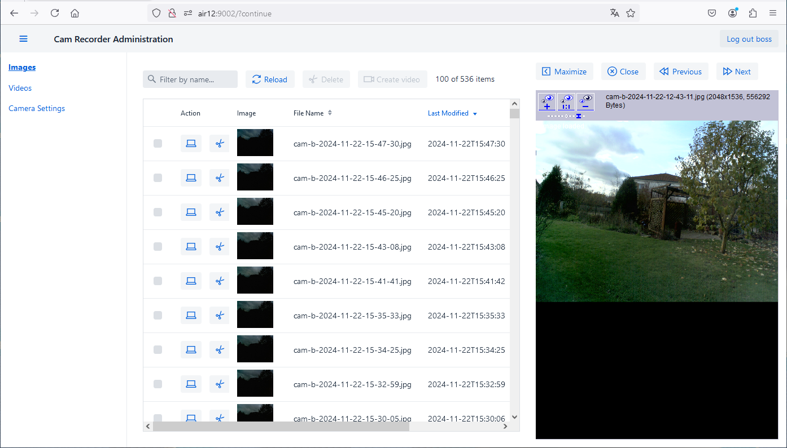
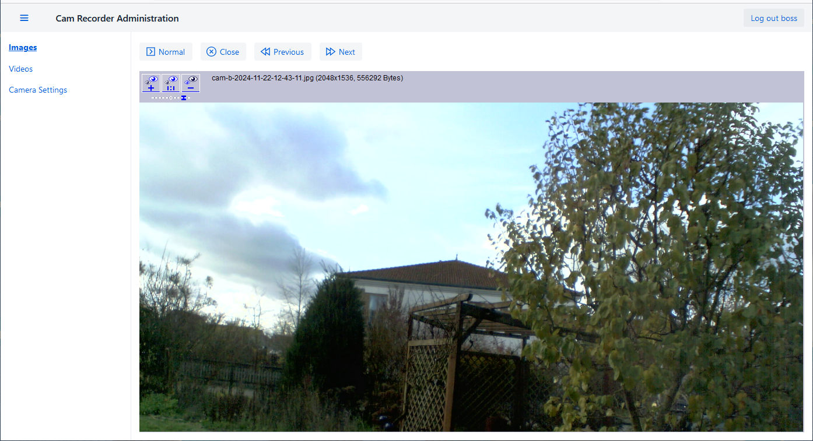

# Client and Server for recording ESP32 camera images

- [client](client/README.md)
- [server](server/README.md)
- [server-ui](server-ui/README.md)

## Flow

When the ESP32Cam starts, it
- sets up WiFi,
- fetches the correct time via NTP
- and enters the **main loop**

The **main loop** performs exactly **one HTTP POST per cycle**, which consists of
- applying *camera settings*, that arrived with the answer of the previous cycle, by re-initializing the camera
- taking a photo — or nothing, if the device is paused
- posting it to the *image server*, with the *device status* (WiFi signal strength, number of camera errors,
  number of image upload errors) in the `cam-status-*` HTTP headers. When paused, the same request is sent
  with an empty body, so the device still reports its status and still receives commands.
- receiving back the *workflow and camera settings* as the answer
  - *workflow settings* are e.g. the delay time till the next photo, going into paused mode, indicator for using the led as a flash, restarting the device, ...
  - *cameras settings* are a larger amount of properties like image size, JPEG quality, exposure levels, white balance, ... 
- restarting the device, if the answer asked for it
- waiting until the next cycle — `delayMsActive` when taking photos, `delayMsPaused` while paused

The loop, the HTTP contract and the diagrams are described in
[docs/loop-architecture.md](docs/loop-architecture.md).

## Workflow and cameras settings 

```json
{
 "workflow": {
   "restart":                 false/true,
   "pause":                   false/true,
   "delayMsActive":           10 - 3600000,
   "delayMsPaused":           10 - 3600000,
   "blinkOnSuccess":          false/true,
   "blinkOnFailure":          false/true,
   "flashLedForPicture":      false/true,
   "flashDurationMs":         10-1000
  },
 "camera": {
   "clockFrequencyHz":        16000000/20000000,
   "frameSize":               1-20,
   "jpegQuality":             0-63,
   "blackPixelCorrect":       0/1,
   "whitePixelCorrect":       0/1,
   "gammaCorrect":            0/1,
   "lensCorrect":             0/1,
   "horizontalMirror":        0/1,
   "verticalFlip":            0/1,
   "brightness":              -2/-1/0/1/2,
   "contrast":                -2/-1/0/1/2,
   "sharpness":               -2/-1/0/1/2,
   "saturation":              -2/-1/0/1/2,
   "denoise":                 -2/-1/0/1/2,
   "specialEffect":           0-6,
   "autoWhitebalance":        0/1,
   "autoWhitebalanceGain":    1,
   "whitebalanceMode":        0-4,
   "exposureCtrlSensor":      0/1,
   "exposureCtrlDsp":         0/1,
   "autoExposureLevel":       0,
   "autoExposureValue":       0-1023,
   "autoExposureGainControl": 0/1,
   "autoExposureGainValue":   0-30,
   "autoExposureGainCeiling": 0-6,
   "downscaleImage":          0/1
 }
}
```

## UI

Form for Camera Settings



List of captured images



List of created timelapse videos



Captured image list with image display side-by-side



Full view of a captured image

