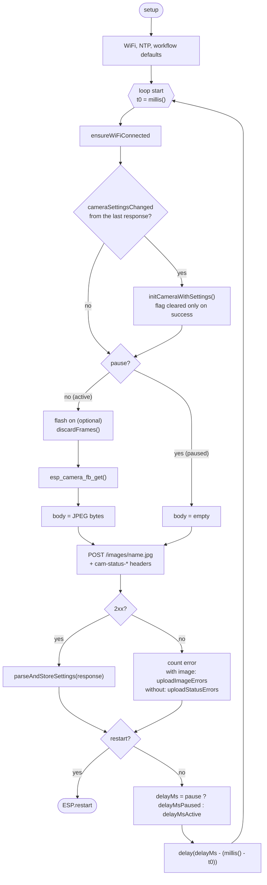
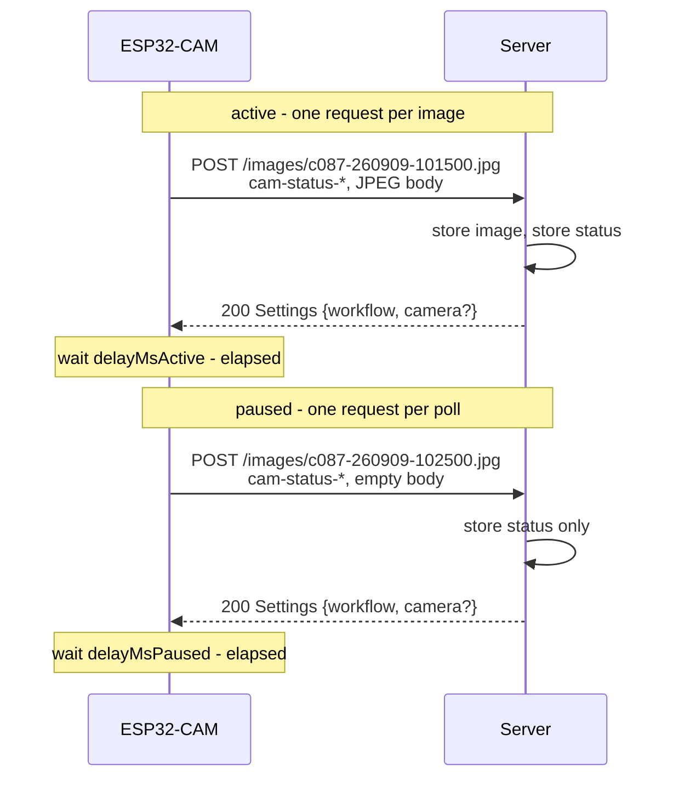

# Loop architecture of the ESP32-CAM client

Plan for the two changes:

1. **One request type** — the camera status travels as HTTP headers on the image POST, the separate
   `PUT /status` disappears.
2. **Two cycle intervals** — `delayMs` is split into `delayMsActive` and `delayMsPaused`.

This document describes the architecture and lists the changes per component. **Both changes are
implemented**; section 4 therefore describes what was done, not what is planned.

## 1. Current state

Every iteration of `loop()` sends **two** requests when the camera is active:

| # | request | purpose | response |
|---|---|---|---|
| 1 | `PUT /status` with a JSON body | report status, fetch commands | `Settings` JSON |
| 2 | `POST /images/<name>.jpg` with the JPEG | deliver the image | `Settings` JSON |

Both responses carry the same `Settings` object, so the second one is a duplicate of the first. At the
default interval of 20 s that is 8640 requests per day instead of 4320.

When the camera is paused, only request 1 is sent, at the same `delayMs` as in active mode. A camera that
should idle at one poll per 10 minutes therefore keeps polling every 20 s.

## 2. Target state

### 2.1 One request per cycle

```
POST /images/<cameraName>-<timeLabel>.jpg
Content-Type:  image/jpeg
Accept:        application/json
cam-status-*:  <status attributes>

<JPEG bytes>          <- active mode
<empty>               <- paused mode (Content-Length: 0)
```

The response is the unchanged `Settings` JSON in both cases, so the client keeps a single response handler.
The server decides by the content length whether an image has to be stored:

* `Content-Length > 0` → store the file, then answer with the settings.
* `Content-Length == 0` → store nothing, answer with the settings. The file name in the path is ignored.
* header missing (`-1`, e.g. a chunked upload) → treated as an image, as before.

> The Arduino `HTTPClient` adds `Content-Length` **only** for a non-empty payload
> (`if (payload && size > 0)` in `sendRequest()`). The client therefore sets the header explicitly for the
> status-only request — without it the server would try to store an empty file.

### 2.2 Status headers

All eight attributes of `CameraStatus` become headers with the prefix `cam-status-`:

| Java field (`CameraStatus`) | header |
|---|---|
| `cameraName` | `cam-status-camera-name` |
| `rssi` | `cam-status-rssi` |
| `imageCounter` | `cam-status-image-counter` |
| `imageErrors` | `cam-status-image-errors` |
| `cameraInitCounter` | `cam-status-camera-init-counter` |
| `cameraInitErrors` | `cam-status-camera-init-errors` |
| `uploadImageErrors` | `cam-status-upload-image-errors` |
| `uploadStatusErrors` | `cam-status-upload-status-errors` |

Missing headers are treated as `0` resp. `null`, so a request without any `cam-status-*` header is still
accepted — that keeps `curl` and the integration tests simple.

**Semantics of the two error counters change**, because there is only one request type left:

* `uploadImageErrors` — failed requests **with** an image (active mode).
* `uploadStatusErrors` — failed requests **without** an image (paused mode).

Their sum is still "all failed uploads", the field names and therefore `CameraStatusRecord`, the UI grid and
the already recorded history stay untouched.

### 2.3 Two intervals

`WorkflowSettings.delayMs` is replaced by:

| field | default | used when |
|---|---|---|
| `delayMsActive` | 20 000 | `pause == false` — interval between two images |
| `delayMsPaused` | 60 000 | `pause == true` — interval between two status-only requests |

The interval is chosen **after** the response has been evaluated, i.e. with the freshly received `pause`
flag. A resume therefore takes effect with the short interval immediately, instead of waiting out one long
paused interval first.

## 3. The loop



Sequence for the two modes:



### Order of the steps

Two consequences of merging the requests are worth stating explicitly:

1. **Camera settings apply one cycle later.** Until now `PUT /status` ran *before* the photo, so new camera
   settings could be applied in the same iteration. Now the settings arrive with the response *after* the
   photo, and are applied at the beginning of the next cycle (step `L2`). The sticky
   `cameraSettingsChanged` flag introduced with fix A1 already handles exactly this.
2. **The reported status describes the beginning of the cycle.** The headers are built before the request,
   so the result of the current upload appears in the next request. That is unchanged behaviour — the
   present `PUT /status` has the same property.

## 4. Changes per component

### 4.1 Client — `client/ESP32CamTimelapse/ESP32CamTimelapse.ino`

* Delete `uploadStatus()` and `TARGET_URL_STATUS`.
* New `addStatusHeaders(HTTPClient& http)` with the eight `http.addHeader("cam-status-...", String(value))`
  calls.
* Generalise `sendPhotoViaHttp()` to `sendToServer(const uint8_t* body, size_t length, const char* timeLabel)`
  and call `http.POST((uint8_t*) body, length)` — with `length == 0` the Arduino `HTTPClient` sends
  `Content-Length: 0`, which is what the server keys on.
* `shootAndSend()` becomes `runCycle()`: capture in active mode, empty body in paused mode, one call to
  `sendToServer()`.
* Constants: `DEFAULT_DELAY_MS`/`MIN_DELAY_MS`/`MAX_DELAY_MS` → `DEFAULT_DELAY_ACTIVE_MS = 20000`,
  `DEFAULT_DELAY_PAUSED_MS = 60000`, limits unchanged.
* `loop()` per the diagram above, especially: choose the interval after `parseAndStoreSettings()`.
* Count a failed request into `uploadImageErrors` or `uploadStatusErrors` depending on the mode.

### 4.2 Server

| File | Change |
|---|---|
| `service/api/CameraStatus.java` | Static factory `fromHeaders(HttpHeaders headers)`, tolerant of missing headers. Returns `null` (or an empty `Optional`) when not even `cam-status-camera-name` is present, so that foreign POSTs are not recorded as a camera. |
| `controller/CameraController.java` | `uploadImage()` gets `@RequestHeader HttpHeaders headers`; store the status via `cameraStatusService.store(...)`; skip `fileService.storeFile(...)` when `contentLength == 0`; **remove** `PUT /status`. |
| `controller/CameraController.java` | `updateSettings(settingsToReturn, 1)` currently passes a hard-coded `1`. With the header the real `cameraInitCounter` is available, so pass it — then a camera that rebooted (counter `0`) automatically gets the camera settings again, exactly as with the old `PUT /status`. |
| `service/api/WorkflowSettings.java` | `delayMs` → `delayMsActive` (20000) + `delayMsPaused` (60000), getters, setters, `toString()`. |
| `src/test/.../CameraControllerIT.java` | `uploadStatus()` no longer applies — rewrite as "POST with empty body and status headers". Extend `test1_uploadImageFile()` by the `cam-status-*` headers and an assertion that the status was recorded. |

`GET /status/{cameraName}`, `GET /cameras` and `CameraStatusService` stay unchanged — only the write path
moves.

### 4.3 server-ui

| File | Change |
|---|---|
| `service/api/WorkflowSettings.java` | Same two fields as in the server (the class is duplicated in both modules). |
| `views/settings/WorkflowSettingsForm.java` | Replace `IntegerField delayMs` with `delayMsActive` and `delayMsPaused`, e.g. *"Delay (ms) between two images"* and *"Delay (ms) while paused"*. `binder.bindInstanceFields(this)` binds by field name, so the names are enough; adapt `setMin/setMax/setSuffixComponent` and the `formLayout.add(...)` block. |

### 4.4 Configuration

`camera-settings.json` still contains `"delayMs": 20000`. `ObjectMapperBuilder` disables
`FAIL_ON_UNKNOWN_PROPERTIES`, so the old key does **not** break the startup — it is silently ignored and the
new fields take their Java defaults until the settings are saved once from the UI. Cleaner is to edit the
file together with the code:

```json
"workflow": { ..., "delayMsActive": 20000, "delayMsPaused": 60000, ... }
```

## 5. Effect

| | requests/day at 20 s | |
|---|---|---|
| active, today | 8 640 | `PUT /status` + `POST /images/...` |
| active, new | 4 320 | one POST |
| paused, today | 4 320 | `PUT /status` every 20 s |
| paused, new | 1 440 | one POST every 60 s |

The saving is mostly the second TCP connection setup per cycle, not the transferred bytes — the eight
headers are roughly 250 bytes, about as much as the JSON body they replace.

## 6. Rejected alternatives

* **Own endpoint for the paused poll** (e.g. `POST /camera-ping`). Would be more explicit than an empty
  body, but produces two request types again and a second response path on the client — the opposite of the
  objective.
* **Second mapping `POST /images` without a file name** for the paused case. Avoids the meaningless file
  name in the path, but Spring then needs two handler methods or an optional `@PathVariable`, and the
  client needs two URLs. Kept as a fallback should the empty body cause trouble with a proxy.
* **Status as query parameters** instead of headers. Would appear in the access log of every image upload
  and make the file name harder to read there.

## 7. Deviations from the plan during the implementation

* **A failed capture also sends.** If `esp_camera_fb_get()` returns nothing, the client now sends the
  status-only request instead of skipping the cycle. Otherwise a camera with defective hardware would never
  receive a command again — with the old two-request loop the `PUT /status` still went out in that case.
* **`Content-Length` is set explicitly** by the client for the empty request, see the note in section 2.1.
* **Missing `Content-Length` counts as an image.** The plan said "`== 0` → store nothing"; the
  implementation follows that literally instead of `<= 0`, so an upload without the header (chunked, as the
  integration test does it via `InputStreamResource`) keeps storing the image.

## 8. Open points

* The file name of the paused request is arbitrary. Proposal: send the same
  `<cameraName>-<timeLabel>.jpg` as in active mode, so client and server keep one code path. The server
  must not validate it when the body is empty.
* Should a paused camera still deliver a *last* image before it goes to sleep? Currently pause takes effect
  immediately with the next cycle. Left unchanged.
* `MIME_TYPE_JSON` is only needed for the `Accept` header after the change — the request body is always
  `image/jpeg`, even when empty, so that the `consumes` mapping of the controller still matches.
